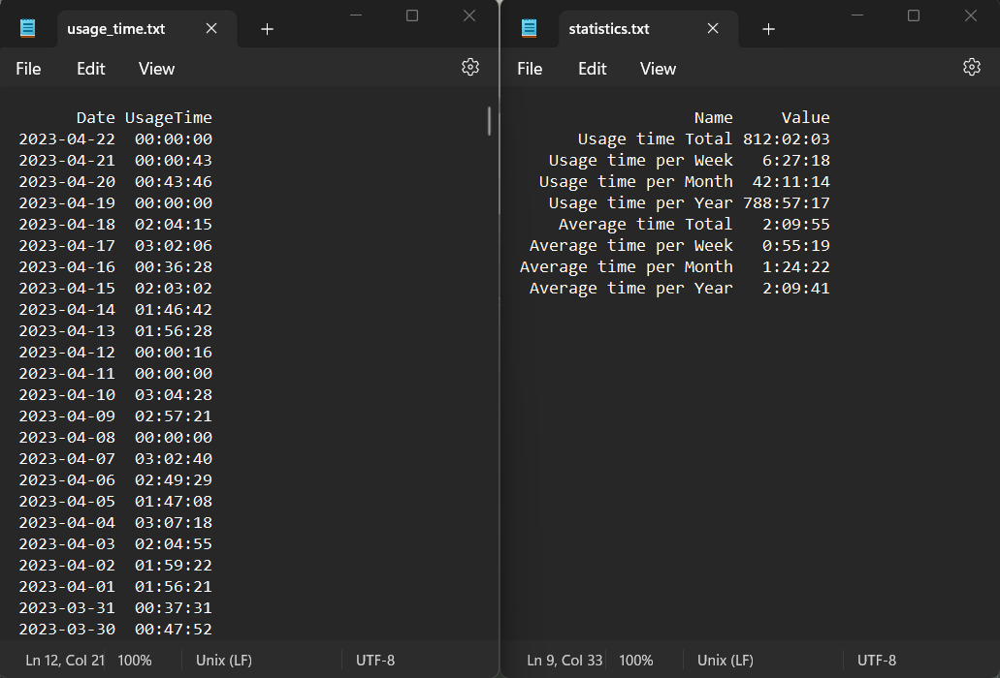
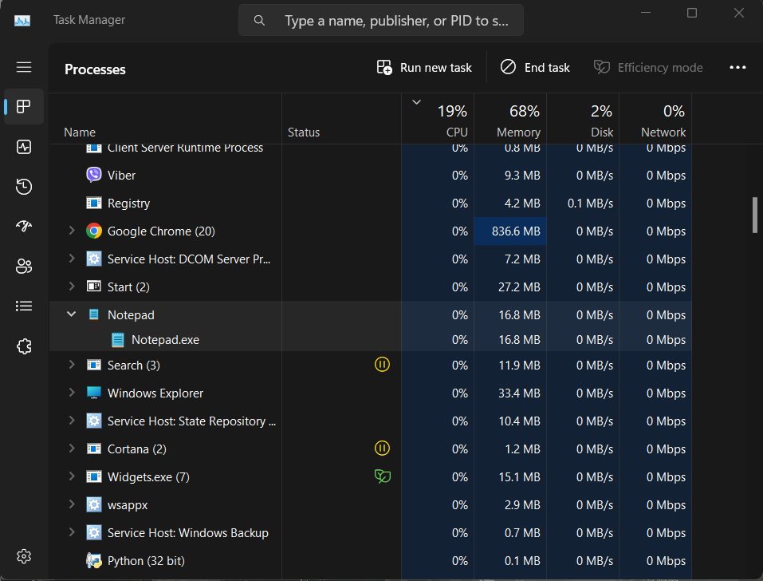
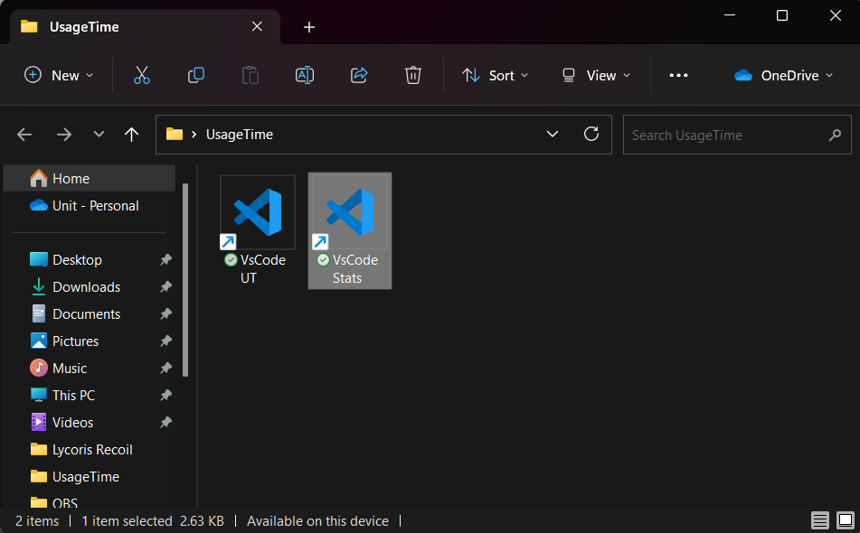

# Usage Time of any app or game

With this you can monitor how much time you spend on using any app or game on your pc. You can see usage time on any day; total hours you've spent; average usage time and more.

## General Info

Lets pretend you want to know how much time you're wasting on League of Legends. All you should do is just install all properly, and the program will automatic start when you start LoL and automatic close when you close LoL (it's doesn't have any interface, so you won't see anything since the main file is .pyw), calculating and writing all required data. The data is written in regular .txt and .csv files. You don't have to do anything else, just watch your statistics whenever you want.
## Features

- This program requires only installation, and then you can just forget about it; just take a look in a certain folder to see info you want in any time.
- You can see usage time every day since you've installed the program
- You can see total usage time, usage time per week, month and year; average usage time, average time per week, month and year.
## Technologies

- Python 3.10.6
- NumPy 1.24.2
- pandas 2.0.0
- psutil 5.9.4
## Installation

At first, you should have installed Python on your computer. If you have, create a folder 'UsageTime' in "C:\Program Files" (you can use any other name and create it in other local disk).

Lets use Notepad for this example. Inside UsageTime create new folder called 'Notepad'. Clone repository in this folder and open it in any text editor.

You need to run Notepad and open task manager (Ctrl+Alt+Delete). Now find a process called 'Notepad', right click > Expand. There you'll see a process name - 'notepad.exe'. Open file 'config.py' and paste 'notepad.exe' in variable 'PROC_NAME'.

If you now run file 'usage_time.pyw' and then run Notepad, wait a few seconds and close Notepad (usage_time.pyw will close automatically after that), you can check 'usage_time.txt' in UsageTime folder. There will be today's date and time that Notepad was opened.

Of course you don't want to run this every time manually. For this we will create .bat file, which will start Notepad and usage_time.pyw file simultaneously.

There is 'start.bat' file in our repository. Open it in a text editor and there will be comments what to do with it.

After this, make a shortcut to the 'start.bat' file and move it to a desktop. Now if you want you can change name and icon (normally an app icon is located right in app folder).

Now if you run this shortcut, it will run Notepad and usage_time.pyw file simultaneously. And when you close Notepad, usage_time.pyw close automatically, writing all required data.

For convenience you can also create a shortcut to usage_time.txt file and put it in a folder; so you don't need to search this folder each time.
